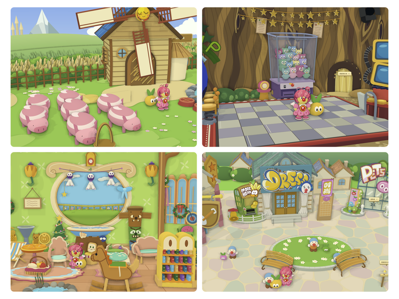

# 摩尔庄园 · 3D 世界

根据场景参考图制作的 Three.js 小世界，包含 15 个详细场景和全岛总览。保留独立网页版与离线小红书小工具版，可环绕观察、缩放、点击地面行走，并通过建筑入口进入室内。



## 功能

- 摩尔城堡、大厅、书房、爱心教堂、淘淘乐街、宠物店、拉姆学院与教室。
- 摩尔农场、开心牧场、摩尔家园与家园小屋、西部游乐场与游戏小屋、阳光海滩。
- 粉色礼裙摩尔主角、跟随拉姆、场景间通行与循环背景音乐。
- 手机竖屏首次打开时，整个小工具已旋转 90°；横拿手机即可查看。
- 小工具一次保留一个场景，并在切换时释放场景资源；网页版缓存已访问的场景。

可直接使用的网页 HTML 和小红书 ZIP 见 [Releases](https://github.com/zcy530/mole-manor-3d/releases)。本次构建与运行检查见 [验证记录](docs/VALIDATION.md)。

## 本地运行

使用 Node.js 20.19 或更新版本。依赖通过公共 npm registry 安装。

```sh
npm run install:apps
npm run dev
```

开发页面：<http://127.0.0.1:4174>。

## 构建与打包

```sh
npm run build
npm run package:xhs
```

| 产物 | 用途 |
| --- | --- |
| `web/dist/index.html` 及同目录资源 | 静态网页，可部署至静态文件服务器 |
| `web/dist/摩尔庄园.html` | 可直接打开的离线单文件网页 |
| `xhs/app/` | 小红书小工具的离线入口及资源 |
| `mole-manor-xhs.zip` | 小红书上传包，根目录包含五个入口文件 |

预览小工具：

```sh
python3 -m http.server 4180 --directory xhs/app
```

随后打开 <http://127.0.0.1:4180>。背景音乐遵循浏览器限制，在首次交互后播放。

## 目录

```text
web/                 网页版源码、素材、Vite 构建
xhs/                 离线小工具源码、压缩素材及打包脚本
docs/preview.png     场景预览
docs/licenses/       Three.js 许可证
```

两版使用各自固定的 Three.js 版本：网页为 0.169.0，小工具为 0.160.1。小工具构建时生成用于离线渲染的本地 vendor，输出 JavaScript 经过 ES2017 / Chrome 61 能力检查。

## 验证

安装 Google Chrome 后运行：

```sh
npm run test:web
npm run test:xhs
```

手机模拟测试额外需要 Python 3 与 Pillow：

```sh
python3 -m pip install Pillow
npm run test:mobile
```

可用 `MANOR_PYTHON` 指定 Python 可执行文件。测试报告保存在各版本的 `evidence/` 中，该目录不提交。浏览器及触摸模拟验证不等于实体手机或实际小红书容器验收。

## 素材与第三方组件

Three.js 采用 MIT 许可证，副本位于 `docs/licenses/`。场景参考图、角色形象、商标与背景音乐来自用户提供的素材，相关权利归各自权利人；它们不因本仓库公开而获得额外授权。
